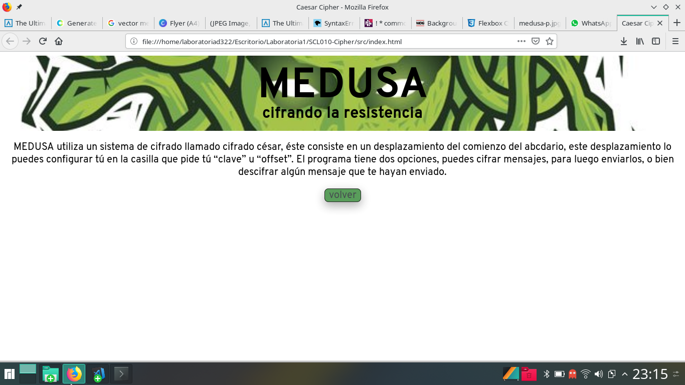
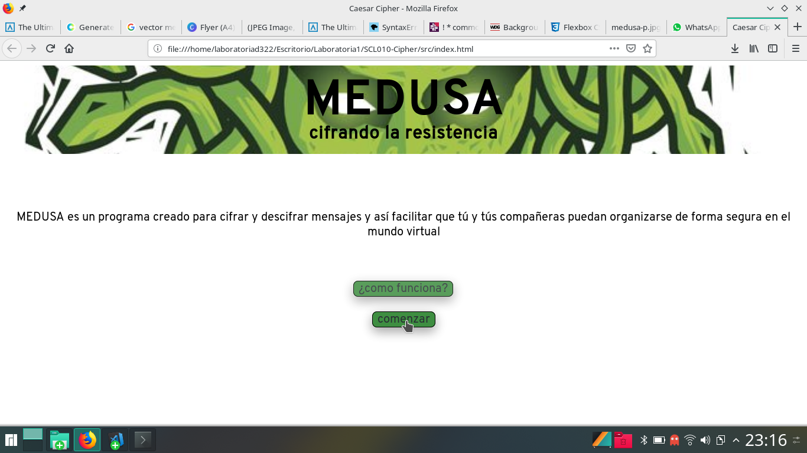
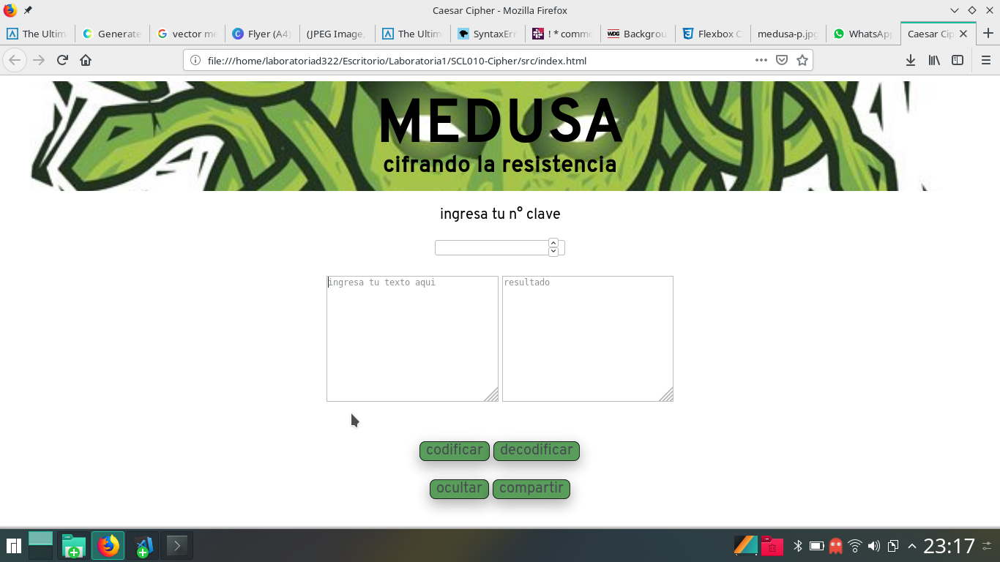
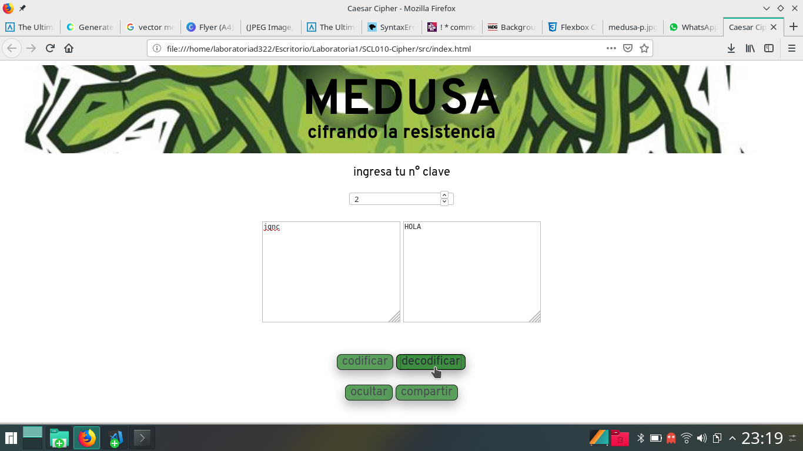

# MEDUSA 
### cifrando la resistencia

Esta aplicación web fue creada para facilitar una comunicación segura a través de redes sociales e internet en general, para mujeres que necesitan organizar eventos de disidencia política, en caso de que sean no autorizados, no legales o para personas que viven en países donde la libertad de expresión no esta garantizada dentro de la constitución.

Aplicaciones como **Whatsapp** manejan sistemas de cifrado propios que son altamente efectivos en cuanto a resguardar la seguridad de los mensajes, pero ésta aplicación nunca ha sido la ideal para organizar eventos con una alta convocatoria, debido a lo engorroso que resulta ya que requiere primero conocer el número de teléfono de todas las personas que participaran para poder incluirlas en el chat y traspasarles la información. Además la interfaz no es muy amigable para administrar organizademente una tan gran cantidad de mensajes como la habría si estamos planeando un evento más masivo.

Es por esto que gran parte de estos eventos son organizados a través deplataformas como  **Facebook**, debido a que la red social cuenta con plantillas especificas para organizar eventos, que facilitan una óptima distribución y manejo de la información, y al mismo tiempo es más sencillo difundirlo y hacerlo llegar a más gente. 

Aqui entra la funcionalidad del programa MEDUSA, ya que permite que puedan entregar esta infromación delicada de forma abierta y que solo la gente que tenga la clave pueda entenderla. Para esto nuestro programa utiliza un sistema de cifrado llamado cifrado César

El cifrado césar es una de las técnicas más simples para cifrar un mensaje. Es un tipo de cifrado por sustitución, es decir que cada letra del texto original es reemplazada por otra que se encuentra un número fijo de posiciones (desplazamiento) más adelante en el mismo alfabeto.

Por ejemplo, si usamos un desplazamiento (_offset_) de 3 posiciones:

- La letra A se cifra como D.
- La palabra CASA se cifra como FDVD.
- Alfabeto sin cifrar: A B C D E F G H I J K L M N O P Q R S T U V W X Y Z
- Alfabeto cifrado: D E F G H I J K L M N O P Q R S T U V W X Y Z A B C

___

### Primera iteración de la aplicación web MEDUSA de sistema de cifrado César  

___

___

### Test de usabilidad

El test de usabilidad que decidí realizar para obtener feedback fue el de entrevistas con usuarios reales. Para esto seleccione a tres mujeres que militan activamente dentro del feminismo, pero que son de distintos rangos etarios, para así tener una mejor representatividad del test.

#### Objetivos

- saber si se entiende la temática de la página
- saber si las decisiones de diseño ayudan a transmitir la temática
- saber si con la información proporcionada se entiende en que consiste el sistema de cifrado
- saber si se entiende cómo se cifra o descifra un mensaje
- observar si la aplicación es lo suficientemente intuituva para que la puedan utilizar sin necesitar hacerme preguntas
- saber si queda clara la utilidad de cada botón

#### Pasos

1. la usuaria debe mirar el primer despliegue de la página, leerlo sin realizar ninguna acción y explicarme cuál entiende que esla finalidad de ésta
2. indicar a la usuaria que presione el botón saber más y lea la explicación extendida, luego preguntarle si esto le aporto alguna información nueva que considere relevante
3. observar si entiende como volver atrás al punto de partida
4. hacer que presione el botón comenzar e intente cifrar un mensaje, observar si entendió que primero debía ingresar un número de desplazamiento en la casilla y que ésto era un paso necesario para que el cifrado descifrado funcionara
5. observar si entiende la funcionalidad de los botones "cifrar" y "descifrar"
6. preguntarle si entiende para que sirve la clave de desplazamiento

### Aplicación test de usabilidad

#### Usuaria A: Mujer de 18 años 

1. la usuaria debe mirar el primer despliegue de la página, leerlo sin realizar ninguna acción y explicarme cuál entiende que es la finalidad de ésta

*"que es como una plataforma segura para interactuar con las personas, para facilitar el comunicarse"* no le queda claro que es solo para cifrar y no para enviar mensajes.
    
2. indicar a la usuaria que presione el botón saber más y lea la explicación extendida luego preguntarle si esto le aporto alguna información nueva que considere relevante

*"es para guardar los mensajes para que quede más privada, es que la guardes en una caja con un candado"*

3. observar si entiende como volver atrás al punto de partida

logra volver atrás sin ningún problema

4. hacer que presione el botón comenzar e intente cifrar un mensaje, observar si entendió que primero debía ingresar un número de desplazamiento en la casilla y que ésto era un paso necesario para que el cifrado descifrado funcionara

ingresa la clave de desplazamiento y un texto en la casilla que corresponde, pero luego también escribe en la casilla de resultado, no entiende que debe presionar el botón codificar, tampoco entendió qué hacía la casilla del offset

5. observar si entiende la funcionalidad de los botones "cifrar" y "descifrar"

no entendió al primer intento

6. preguntarle si entiende para que sirve la clave de desplazamiento

*"entiendo que es una clave que debo tener para descifrar el mensaje"*

#### Usuaria B: Mujer de 32 años 

1. la usuaria debe mirar el primer despliegue de la página, leerlo sin realizar ninguna acción y explicarme cuál entiende que esla finalidad de ésta

*"es un programa para cifrar mensajes y enviarlos".*   

2. indicar a la usuaria que presione el botón saber más y lea la explicación extendida, luego preguntarle si esto le aporto alguna información nueva que considere relevante

*"entendí que tiene un sistema, que tiene un nombre que se llama César, no me queda claro a que se refiere con desplazamiento del abecedario".*

3. observar si entiende como volver atrás al punto de partida

entiende como volver atrás sin problema.

4. hacer que presione el botón comenzar e intente cifrar un mensaje, observar si entendió que primero debía ingresar un número de desplazamiento en la casilla y que ésto era un paso necesario para que el cifrado descifrado funcionara

primero ingresó el texto que quería cifrar y presionó el botón codificar, se dió cuenta que no le estaba devolviendo el mensaje cifrado, luego se dio cuenta de que no había llenado la casilla de offset, luego de hacerlo logró cifrar el mensaje.

5. observar si entiende la funcionalidad de los botones "cifrar" y "descifrar"
entendió sin problema

logró usar los botones de acuerdo a sus intenciones sin problema.

6. preguntarle si entiende para que sirve la clave de desplazamiento

*"entiendo que es necesario escribirla, pero no entiendo realmente que hace".*

#### Usuaria C: Mujer de 28 años

1. la usuaria debe mirar el primer despliegue de la página, leerlo sin realizar ninguna acción y explicarme cuál entiende que esla finalidad de ésta  

*"que es un programa para organizarse entre mujeres, podría ser una red social incluso."*

2. indicar a la usuaria que presione el botón saber más y lea la explicación extendida, luego preguntarle si esto le aporto alguna información nueva que considere relevante

*"te explica como funciona el cifrado, entiendo que yo debo configurarlo y ahí voy a entender como funciona, entiendo que yo voy a decidir en que letra comenzará el abecedario para mi, y podré descifrar los mensajes en mi idioma pordecirlo de alguna forma."*

3. observar si entiende como volver atrás al punto de partida

logra volver atrás sin problema.

4. hacer que presione el botón comenzar e intente cifrar un mensaje, observar si entendió que primero debía ingresar un número de desplazamiento en la casilla y que ésto era un paso necesario para que el cifrado descifrado funcionara

ingreso primero el offset y luego el mensaje que quería cifrar y logró cifrarlo sin mayor problema, sugirió que en esta parte debería haber un botón para volver atrás.

5. observar si entiende la funcionalidad de los botones "cifrar" y "descifrar"

entendió el propósito de los botones sin problema.

6. preguntarle si entiende para que sirve la clave de desplazamiento

*"si, entiendo que es la cantidad de espacios que se moverá el comienzo de mi abecedario."*

___

### Conclusiones del test de usabilidad

El test de usabilidad me permitió encontrar errores cruciales que se repitieron con todos los usuarios. El primer error que apareció es que las usuarias no entendían exactamente cuál era la funcionalidad del programa, y la confundían con la idea de que era una aplicación de envío de mensajes en lugar de una de cifrado y descifrado de mensajes. Para solucionar extendía tanto la primera presentación, como la que se despliega al hacer clic en el botón *¿cómo funciona?*, además de extenderla también fui más especifica al exponer la finalidad de la aplicación web.  
Otra confusión que note fue que ninguna tenía completamente claras las acciones que debía realizar para lograr cifrar su mensaje, así que incorporé una lista simple de instrucciones.  
También descubrí que producía confusión el hecho de que la orden sobre la casilla para ingresar el offset dijera *ingresa tu número clave* ya que la palabra clave hacía pensar que era número que debían conocer de forma previa y no un número que indicaba la cantidad de carácteres que se desplazaria su abecedario, por esto lo cambie a *clave de desplazamiento*, además de extenderme un poco más en su explicación en el texto que se despliega al hacer clic en *¿cómo funciona?*

___

## Segunda iteración de la aplicación web MEDUSA de sistema de cifrado César

___

### Elecciones de diseño

ya que la aplicación web MEDUSA esta directamente dirigida a usuarias mujeres, la intención fue mantener la paleta de colores en tonos que son generalmente asociados con la feminidad, como el rosado de fondo que según la sicología del color plantea, es un tono que induce a la relajación y a un sentimiento de seguridad, algo muy necesaro ya que se esta trabajando con mensajes delicados cuya privacidad la persona quiere resguardar al punto de estaren una aplicación que le permite cifrarlo. 

los botones de todas las interacciones de la página son amarillos, ya que es un color que llama a  la acción además de ser asociado con el intelecto.

Es un color que al igual que el rosado también transmite cálidez, por lo que ayuda a construir una sensación integral de estar entrando a un espacio seguro, confiable, acogedor y alegre que usarían y recomendarían. 

El fondo de la  aplicación web además de ser rosado contiene imágenes de puños alzados, los comienzos de esta iconografía se remontan a las primeras propagandas de organizaciones sindicales y ha sido luego de esto adoptado como simbolismo de varios grupos "radicales" entre estos el feminismo. Es un simbolismo que logra encapsular la idea de resistencia, solidaridad, orgullo y militancia.

Me pareció apropiada ya que se vuelve una imagen que representa directamente los intereses del publico objetivo de esta aplicación web, al ser éste público objetivo mujeres que estan buscando organizar la resistencia. Al mantenerse el mismo fondo a través de todas las interacciones de la aplicación web, construye una sensación de compañerismo y consecuencia con éste compañerismo.

<<<<<<< HEAD
=======
___

### Segunda iteración de la aplicación web MEDUSA de sistema de cifrado César

>>>>>>> a5c12fc69fd91f36fa5fc572ec468006880de009

<<<<<<< HEAD
=======

### General

| Característica/Habilidad |
|--------------------------|
| Completitud |

### Habilidades Blandas

| Habilidad |
|-----------|
| Planificación y organización |
| Autoaprendizaje |
| Solución de problemas |
| Dar y recibir feedback |
| Adaptabilidad |
| Trabajo en equipo |
| Comunicación eficaz |
| Presentaciones |

### Habilidades Técnicas Front-end

| Habilidad |
|-----------|
| **CS** |
| Lógica |
| Arquitectura |
| **SCM** |
| Git |
| GitHub |
| **JavaScript** |
| Estilo |
| Nomenclatura/semántica |
| Funciones/modularidad |
| Tests |
| **HTML** |
| Validación |
| Estilo |
| Semántica |
| **CSS** |
| DRY |
| Responsive |

### Habilidades Técnicas UX

| Habilidad |
|-----------|
| User Centricity |

***

## Pistas sobre cómo comenzar a trabajar en el proyecto

1. Antes que nada, asegúrate de tener un :pencil: editor de texto en
   condiciones, algo como [Atom](https://atom.io/) o
   [Code](https://code.visualstudio.com/).
2. Para ejecutar los comandos a continuación necesitarás una :shell:
   [UNIX Shell](https://github.com/Laboratoria/curricula-js/tree/v2.x/topics/shell),
   que es un programita que interpreta líneas de comando (command-line
   interpreter) así como tener [git](https://github.com/Laboratoria/curricula-js/tree/v2.x/topics/scm/01-git)
   instalado. Si usas un sistema operativo "UNIX-like", como GNU/Linux o MacOS,
   ya tienes una _shell_ (terminal) instalada por defecto (y probablemente `git`
   también). Si usas Windows puedes usar [Git bash](https://git-scm.com/download/win),
   aunque recomendaría que consideres probar :penguin: GNU/Linux.
3. Haz tu propio :fork_and_knife: [fork](https://help.github.com/articles/fork-a-repo/)
   del repo de tu cohort, tus _coaches_ te compartirán un _link_ a un repo y te 
   darán acceso de lectura en ese repo.
4. :arrow_down: [Clona](https://help.github.com/articles/cloning-a-repository/)
   tu _fork_ a tu computadora (copia local).
5. 📦 Instala las dependencias del proyecto con el comando `npm
   install`. Esto asume que has instalado [Node.js](https://nodejs.org/) (que
   incluye [npm](https://docs.npmjs.com/)).
6. Si todo ha ido bien, deberías poder ejecutar las :traffic_light:
   pruebas unitarias (unit tests) con el comando `npm test`.
7. A codear se ha dicho! :rocket:

## Recursos y temas relacionados

A continuación un video de Michelle que te lleva a través de la fórmula
matemática del Cifrado César y un par de cosas más que debes saber para
resolver este proyecto. ¡Escúchala con detenimiento y sigue sus consejos! :)

Diseño de experiencia de usuario (User Experience Design):

- Ideación
- Prototipado (sketching)
- Testeo e Iteración

Desarrollo Front-end:

* [Valores](https://lms.laboratoria.la/cohorts/scl-2019-06-bc-core-scl010/courses/javascript/01-basics/01-values-variables-and-types)
* [Tipos](https://lms.laboratoria.la/cohorts/scl-2019-06-bc-core-scl010/courses/javascript/01-basics/01-values-variables-and-types)
* [Variables](https://lms.laboratoria.la/cohorts/scl-2019-06-bc-core-scl010/courses/javascript/01-basics/02-variables)
* [Control de flujo](https://lms.laboratoria.la/cohorts/scl-2019-06-bc-core-scl010/courses/javascript/02-flow-control/00-opening)
* [Tests unitarios](https://lms.laboratoria.la/cohorts/scl-2019-06-bc-core-scl010/courses/javascript/11-testing/00-opening)
* [Aprende más sobre `charCodeAt()`](https://developer.mozilla.org/es/docs/Web/JavaScript/Referencia/Objetos_globales/String/charCodeAt)
* [Aprende más sobre `String.fromCharCode()`](https://developer.mozilla.org/es/docs/Web/JavaScript/Referencia/Objetos_globales/String/fromCharCode)
* [Aprende más sobre `ASCII`](http://conceptodefinicion.de/ascii/)
* [Documentación de NPM](https://docs.npmjs.com/)

Herramientas:
- [GitHub y GitHub Pages](https://guides.github.com/)
- [Guía de Scrum](https://www.scrumguides.org/docs/scrumguide/v1/scrum-guide-es.pdf): solamente para comenzar a entender cómo organizar tu trabajo.

## Checklist
Esta sección está  para ayudarte a llevar un control de lo que vas completando.

### Parte Obligatoria
* [ ] `README.md` incluye info sobre proceso y decisiones de diseño.
* [ ] `README.md` explica claramente quiénes son los usuarios y su relación con
  el producto.
* [ ] `README.md` explica claramente cómo el producto soluciona los
  problemas/necesidades de los usuarios.
* [ ] Usa VanillaJS.
* [ ] No utiliza `this`.
* [ ] Implementa `cipher.encode`.
* [ ] Implementa `cipher.decode`.
* [ ] Pasa linter con configuración provista.
* [ ] Pasa pruebas unitarias.
* [ ] Pruebas unitarias cubren 70% de _statements_, _functions_ y _lines_, y un
  mínimo del 50% de _branches_.
* [ ] Interfaz permite elegir el `offset` o _desplazamiento_ a usar en el
  cifrado/descifrado.
* [ ] Interfaz permite escribir un texto para ser cifrado.
* [ ] Interfaz muestra el resultado del cifrado correctamente.
* [ ] Interfaz permite escribir un texto para ser descifrado.
* [ ] Interfaz muestra el resultado del descifrado correctamente.

### Parte Opcional: "Hacker edition"
* [ ] Cifra/descifra minúsculas
* [ ] Cifra/descifra _otros_ caracteres (espacios, puntuación, `ñ`, `á`, ...)
* [ ] Permite usar un `offset` negativo.
>>>>>>> a5c12fc69fd91f36fa5fc572ec468006880de009
